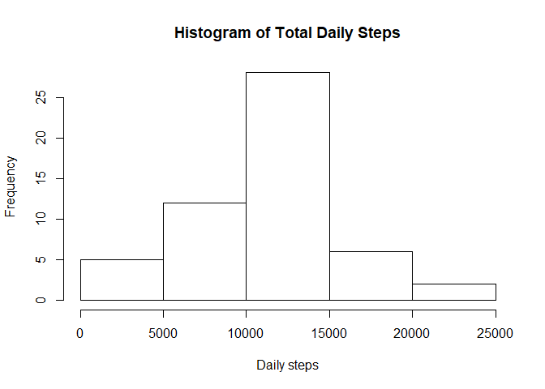
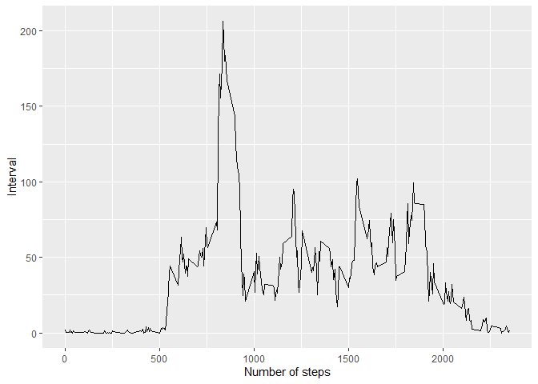
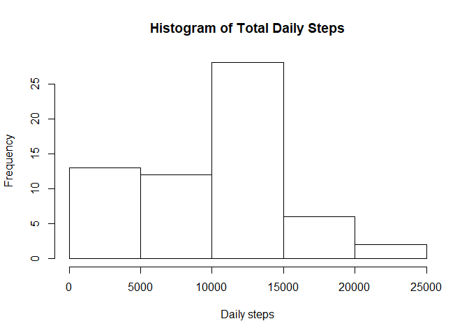
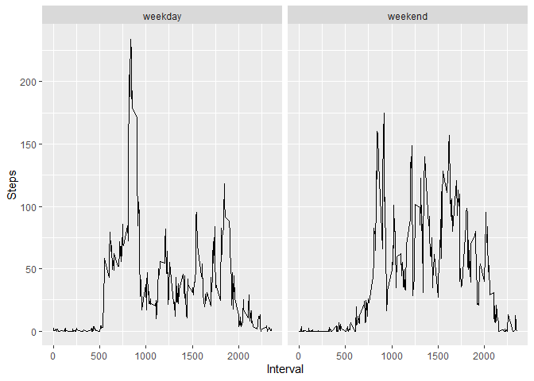

## Importing the necessary libraries


```r
library(dplyr)
```

```
## 
## Attaching package: 'dplyr'
```

```
## The following objects are masked from 'package:stats':
## 
##     filter, lag
```

```
## The following objects are masked from 'package:base':
## 
##     intersect, setdiff, setequal, union
```

```r
library(tidyr)
library(ggplot2)
```

## Loading and preprocessing the data

The data is loaded from the csv file "activity.csv".


```r
activity <- read.csv('activity.csv')
```

Next, the only preprocessing necessary is to set the date variables as a data format.


```r
activity$date <- lubridate::ymd(activity$date)
```

## What is mean total number of steps taken per day?

First, we calculate the total number of steps taken each day and plot the histogram of this variable.

```r
total_daily_data <- drop_na(summarize(group_by(activity,date), total_daily_steps = sum(steps)))
print(total_daily_data)
```

```
## # A tibble: 53 x 2
##    date       total_daily_steps
##    <date>                 <int>
##  1 2012-10-02               126
##  2 2012-10-03             11352
##  3 2012-10-04             12116
##  4 2012-10-05             13294
##  5 2012-10-06             15420
##  6 2012-10-07             11015
##  7 2012-10-09             12811
##  8 2012-10-10              9900
##  9 2012-10-11             10304
## 10 2012-10-12             17382
## # ... with 43 more rows
```

```r
hist(total_daily_data$total_daily_steps, xlab = "Daily steps", main = "Histogram of Total Daily Steps")
```

<!-- -->

Next, the mean and median of the number of steps taken each day are calculated and printed.

```r
mean_total_daily_steps <- mean(total_daily_data$total_daily_steps, na.rm = TRUE)
median_total_daily_steps <- median(total_daily_data$total_daily_steps, na.rm = TRUE)
```

The mean is:


```r
mean_total_daily_steps
```

```
## [1] 10766.19
```

The median is:


```r
median_total_daily_steps
```

```
## [1] 10765
```


## What is the average daily activity pattern?

The time series plot of the average number of steps taken below. This was done by first removing the day with NA values as steps, grouping by the interval variables and taking the mean of the steps variables. 

The plot is done with ggplot2. 


```r
activity_noNA <- activity %>% filter(!is.na(steps))
interval_data <- summarize(group_by(activity_noNA,interval), average_steps = mean(steps))
ggplot(interval_data, aes(x = interval, y = average_steps)) +xlab("Number of steps") +ylab('Interval') + geom_line()
```

<!-- -->

Using the interval_data variables, it is possible to find the 5-minute interval that on average has the maximium number of steps. 


```r
interval_data[which.max(interval_data$average_steps),]
```

```
## # A tibble: 1 x 2
##   interval average_steps
##      <int>         <dbl>
## 1      835          206.
```
The interval with the maximum of steps is 835 with an average of steps of 206.1698 steps.

## Imputing missing values

The strategy used to impute the missing values is to fill them in with the median values of the steps per interval. In that way, the median of the interval of a row with NA as steps value will be filled in to replace NaS.

There are 2304 NA entries in the steps column of the activity data.


```r
sum(is.na(activity$steps))
```

```
## [1] 2304
```
The NA values are imputed.A new dataset is created that is equal to the original dataset but with the missing data filled in.


```r
new_activity <- activity
activity_na_values <- is.na(new_activity$steps)
median_int <- tapply(new_activity$steps, new_activity$interval, median, na.rm = TRUE, )
new_activity$steps[activity_na_values] <- median_int[as.character(new_activity$interval[activity_na_values])]
```
There are no more NA values. 


```r
new_total_daily_data <- drop_na(summarize(group_by(new_activity,date), total_daily_steps = sum(steps)))
hist(new_total_daily_data$total_daily_steps, xlab = "Daily steps", main = "Histogram of Total Daily Steps")
```

<!-- -->
Next, the mean and median of the number of steps taken each day are calculated and printed.

```r
mean_new_total_daily_steps <- mean(new_total_daily_data$total_daily_steps, na.rm = TRUE)
median_new_total_daily_steps <- median(new_total_daily_data$total_daily_steps, na.rm = TRUE)
```

The mean is:


```r
mean_new_total_daily_steps
```

```
## [1] 9503.869
```

The median is:


```r
median_new_total_daily_steps
```

```
## [1] 10395
```
Both median and mean values are smaller than in the first part of this assignment. Imputed the NA reduced both these numbers. It reduced the mean more significantly than the median. 

## Are there differences in activity patterns between weekdays and weekends?

We create a new factor called day_type which indicates if a day is in the weekend or the week. Note that here the days are in Dutch. 


```r
day_type_activity <- activity %>% filter(!is.na(steps))
day_type_activity$date <- lubridate::ymd(day_type_activity$date)
day_type_activity$day <- weekdays(day_type_activity$date)
day_type_activity <- mutate(day_type_activity, day_type = ifelse(weekdays(day_type_activity$date) == "zaterdag" | weekdays(day_type_activity$date) == "zondag", 'weekend', 'weekday'))
```

We now make a plot of th etime series of the 5 minute interval and the average number of steps taken averaged across all weekdays and weekend days. 


```r
int_day_type_activity <- day_type_activity %>% group_by(interval, day_type)
int_day_type_activity <- int_day_type_activity %>% summarise(mean_steps = mean(steps))

ggplot(int_day_type_activity, aes(x=interval, y=mean_steps, colors = day_type))+ylab('Steps')+ xlab('Interval') +geom_line()+facet_wrap(~day_type)
```

<!-- -->
